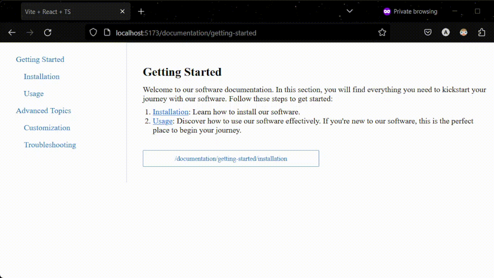
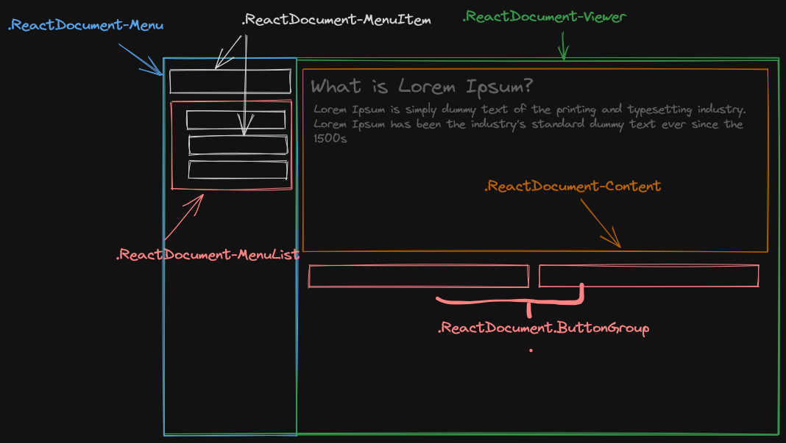

# React Documenter

Untyled React Components for Building Documentation

- **Don't Use This If:** You need a fast, concise, or fun documentation solution. Static Site Generators (SSGs) are more suitable for such cases.
- **Use This If:** You require your documentation to share the same global state as your UI (eg shifting api keys if the user is registered)



## Quickstart

```console
npm install --save react-documenter
```

Here is a small example with mock data. See a more [extensive example](#example) down below

```typescript
import { Menu, mockData, DocumentStore } from "react-documenter"

// ideally this should be in a useEffect hook
const store = new DocumentStore();
mockData.forEach(store.set);

export default function Example() {
    return (
      <Menu store={store} />
    )
}
```

## Components

### Menu

A Nestable Sidebar Menu

- `collapsible`: (Boolean) Defines if clicking on a parent entry collapses its children.
- `store`: (DocumentStore) Defines the content for the menu to render.
- `linkAs`: (String or React Node) Pass a component or a tag to be used as the link, e.g., `a` or `<Link />`.
- `linkHrefProp`: (String) The prop representing the "href" on the link component, e.g., `href` or `to`.
- `onLinkClick`: (Function: (url: string) => void) Defines what to do when a link is clicked.

### Viewer

The Viewer Component with Adjacent Neighbor Navigation

- `pages`: (Array<FlatPage>) An array of `{ url: string, content: string }`.
- `currentPage`: (FlatPage) The current page, used to determine neighbor navigation.
- `onPrevClick`: (Function: (url: string) => void) Invoked when clicking the "previous page."
- `onNextClick`: (Function: (url: string) => void) Invoked when clicking the "next page."

### DocumentStore

**(Not a Component)** - A Class Used to Store Content

- `DocumentStore.get()`: Returns an `Array<Page>`.
- `DocumentStore.getNormalized()`: Flattens all `Page` and their children into a 1D array of `FlatPage`.
- `DocumentStore.set(Page)`: Sets a page with its corresponding URL into the map.

> Additionally, mockData is also exported, this is an `Array<Page>` where `Page` is

```typescript
interface Page {
  title: string;
  url: string;
  content: string;
  children: Array<Page>;
}
```

## Styling

Check out [example/src/App.css](./example/src/App.css) for a reference.

Here is a visual representation of all of the CSS classes and what they correspond to



## Example

Here is an example of how you would use this with [react-router](https://reactrouter.com/en/main).

You can also check this as a working example with styles in [example/src/App.tsx](./example/src/App.tsx).

```typescript
import { useEffect, useState } from "react";
import { useNavigate, Routes, Route } from "react-router";

import { Menu, DocumentStore, Viewer, mockData } from "react-documenter";

import "./App.css"

export default function App() {
  const navigate = useNavigate();
  const [store, setStore] = useState(null);

  useEffect(() => {
    const newStore = new DocumentStore();
    mockData.forEach((page) => newStore.set(page));
    setStore(newStore);
  }, []);

  return (
    <>
      <Menu
        collapsible={false}
        store={store}
        linkAs="a"
        linkHrefProp="href"
        onLinkClick={navigate}
      />
      <Routes>
        {store.getNormalized().map((page, index) => (
          <Route
            key={index}
            path={page.url}
            element={
              <Viewer
                pages={store.getNormalized()}
                currentPage={page}
                onPrevClick={navigate}
                onNextClick={navigate}
              />
            }
          />
        ))}
      </Routes>
    </>
  );
}
```
